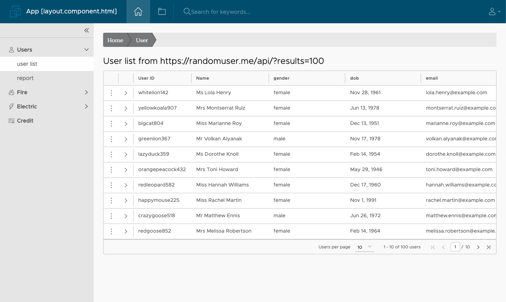

# Angular-Clarity

This project was generated with [Angular CLI](https://github.com/angular/angular-cli) version 11.2.12, [Angular.io](https://angular.io/) version 11.2.13 and [Clarity Design System](https://vmware.github.io/clarity/news) by VMware version 5.2.0

## Install
- clone project `git clone https://github.com/superpck/angular-clarity`
- goto project folder `cd angular-clarity`
- install necessary package `npm install`
- Fix some vulnerabilities (if founded) `npm audit fix --force`
- Run application with command `ng serve` for a dev server. Navigate to `http://localhost:4200/`. The app will automatically reload if you change any of the source files.
- or Run `ng serve --port 8080 --open` with another port and open web browser.

## Code scaffolding

Run `ng generate component component-name` to generate a new component. You can also use `ng generate directive|pipe|service|class|guard|interface|enum|module`.

## Build

- Run `ng build` to build the project. The build artifacts will be stored in the `dist/` directory. Use the `--prod` flag for a production build.
- or `ng build --base-href ./ --prod --output-hashing none`

## Running unit tests

Run `ng test` to execute the unit tests via [Karma](https://karma-runner.github.io).

## Running end-to-end tests

Run `ng e2e` to execute the end-to-end tests via [Protractor](http://www.protractortest.org/).

## Further help

To get more help on the Angular CLI use `ng help` or go check out the [Angular CLI README](https://github.com/angular/angular-cli/blob/master/README.md).

## Screenshot
About Page

Datagrid

Datagrid expand row and single action

Modal

sweetalert2

